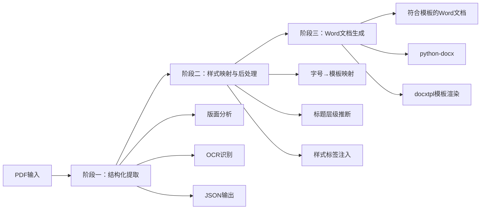

# PDF智能识别与格式规范化系统——完整实现方案

## 一、方案概述

本方案采用 **“结构化提取 → 样式映射 → 模板化生成”** 的三阶段架构，将PDF/扫描件中的内容提取为带位置和样式信息的结构化数据，再根据你的Word格式模板重新生成符合规范的文档。



---

## 二、技术选型

| 阶段 | 推荐工具 | 选型理由 |
|:---|:---|:---|
| **PDF解析与版面分析** | PaddleOCR (PP-StructureV3) 或 MinerU | 支持版面区域检测（标题/正文/表格/图片）、输出JSON/Markdown、中文友好 |
| **表格识别** | PaddleOCR 内置表格识别 | 支持表格结构重建、单元格坐标提取 |
| **后处理与样式映射** | Python 自定义脚本 | 灵活性高，可精确控制字号映射、标题层级推断 |
| **Word文档生成** | python-docx + docxtpl | python-docx控制样式，docxtpl支持模板渲染 |

---

## 三、完整实现步骤

### 阶段一：PDF结构化提取

#### 3.1.1 环境准备（以PaddleOCR为例）

```bash
# 安装PaddleOCR及依赖
pip install paddlepaddle-gpu paddleocr
pip install opencv-python PyMuPDF

# 如需表格识别增强
pip install paddleocr[table]
```

#### 3.1.2 PDF转图像与版面分析

```python
import fitz  # PyMuPDF
import cv2
import numpy as np
from paddleocr import PaddleOCR

# 初始化OCR引擎（开启版面分析）
ocr = PaddleOCR(
    use_angle_cls=True,
    lang='ch',
    table=True,           # 启用表格识别
    use_gpu=True,
    show_log=False
)

def pdf_to_images(pdf_path, dpi=200):
    """将PDF每一页转换为图像"""
    doc = fitz.open(pdf_path)
    images = []
    for page_num in range(len(doc)):
        page = doc.load_page(page_num)
        mat = fitz.Matrix(dpi/72, dpi/72)
        pix = page.get_pixmap(matrix=mat)
        img = np.frombuffer(pix.samples, dtype=np.uint8).reshape(
            pix.height, pix.width, pix.n
        )
        images.append(img)
    return images

def extract_page_structure(image):
    """对单页进行版面分析和OCR识别"""
    result = ocr.ocr(image, cls=True)
    
    # 解析结果：每个元素包含 坐标、文本、置信度、字体信息
    elements = []
    for line in result:
        for item in line:
            bbox = item[0]  # 四个角坐标
            text_info = item[1]  # (text, confidence)
            elements.append({
                'bbox': bbox,
                'text': text_info[0],
                'confidence': text_info[1],
                # 字体信息需要从OCR引擎的详细输出中获取
            })
    return elements
```

#### 3.1.3 使用PP-StructureV3进行版面分析（推荐）

PP-StructureV3能够识别**正文、标题、表格、图片、页眉、页脚**等十余类版面区域，并输出JSON格式的结构化数据。

```python
from paddleocr import PPStructure

# 初始化版面分析引擎
table_engine = PPStructure(
    show_log=False,
    use_gpu=True,
    det_db_box_thresh=0.3,
    det_db_unclip_ratio=1.5
)

def analyze_layout(image):
    """使用PP-StructureV3进行版面分析"""
    result = table_engine(image)
    
    # 返回结果包含每个区域的类型、坐标、内容
    # 类型: 'text', 'title', 'table', 'figure', 'header', 'footer'
    return result
```

输出JSON结构示例：
```json
{
  "pages": [
    {
      "page_num": 1,
      "elements": [
        {
          "type": "title",
          "bbox": [x1, y1, x2, y2],
          "text": "第一章 概述",
          "font_size": 16.5,
          "font_name": "SimSun"
        },
        {
          "type": "text",
          "bbox": [x1, y1, x2, y2],
          "text": "正文内容...",
          "font_size": 12.0,
          "font_name": "SimSun"
        },
        {
          "type": "table",
          "bbox": [x1, y1, x2, y2],
          "html": "<table>...</table>"
        }
      ]
    }
  ]
}
```

#### 3.1.4 提取关键样式信息

从OCR结果中提取**字号、字体、粗体/斜体**等样式信息：

```python
def extract_style_info(elements):
    """从OCR结果中提取样式信息"""
    styled_elements = []
    for elem in elements:
        # 提取字号（PDF内部以磅值表示）
        font_size = elem.get('font_size', 12.0)
        
        # 判断是否为标题（基于字号、加粗、位置等特征）
        is_bold = elem.get('bold', False)
        is_italic = elem.get('italic', False)
        
        # 计算缩进（基于bbox左边界与页面左边界的距离）
        indent = elem['bbox'][0]  # 像素值
        
        styled_elements.append({
            **elem,
            'font_size_pt': font_size,
            'is_bold': is_bold,
            'is_italic': is_italic,
            'indent_px': indent
        })
    return styled_elements
```

---

### 阶段二：样式映射与后处理

#### 3.2.1 字号→模板字号映射

根据你的模板要求【用户提供图片】：
- 一级标题：三号（≈16pt）
- 二级标题：小三号（≈15pt）
- 三级标题：四号（≈14pt）
- 正文：小四号（≈12pt）
- 表格内文字：五号（≈10.5pt）

```python
# 字号映射表（PDF磅值 → Word字号名称 → 磅值）
FONT_SIZE_MAP = {
    '三号': {'pt': 16, 'word_name': '三号'},
    '小三号': {'pt': 15, 'word_name': '小三号'},
    '四号': {'pt': 14, 'word_name': '四号'},
    '小四号': {'pt': 12, 'word_name': '小四号'},
    '五号': {'pt': 10.5, 'word_name': '五号'},
}

def map_font_size(pt_value):
    """将PDF识别的磅值映射到模板字号"""
    # 找最接近的模板字号
    closest = min(FONT_SIZE_MAP.keys(), 
                  key=lambda k: abs(FONT_SIZE_MAP[k]['pt'] - pt_value))
    return FONT_SIZE_MAP[closest]
```

#### 3.2.2 标题层级自动推断

结合**字号、加粗、编号模式、位置**等多维度信息推断标题层级：

```python
import re

def infer_heading_level(elem, prev_elem=None):
    """推断标题层级"""
    text = elem['text']
    font_size = elem.get('font_size_pt', 12)
    is_bold = elem.get('is_bold', False)
    
    # 规则1：基于字号
    if font_size >= 16:
        return 1
    elif font_size >= 15:
        return 2
    elif font_size >= 14:
        return 3
    
    # 规则2：基于编号模式
    heading_patterns = [
        (r'^第[一二三四五六七八九十]+章', 1),
        (r'^第[一二三四五六七八九十]+节', 2),
        (r'^\d+\.\d+\.\d+', 3),
        (r'^\d+\.\d+', 2),
        (r'^[一二三四五六七八九十]+、', 2),
        (r'^（[一二三四五六七八九十]+）', 3),
    ]
    
    for pattern, level in heading_patterns:
        if re.match(pattern, text):
            return level
    
    # 规则3：加粗且字号大于正文
    if is_bold and font_size >= 13:
        return 3
    
    return None  # 不是标题
```

#### 3.2.3 缩进与对齐检测

```python
def detect_alignment(elem, page_width):
    """检测对齐方式"""
    bbox = elem['bbox']
    left = bbox[0]
    right = bbox[2]
    elem_width = right - left
    
    # 计算缩进（相对于页面左边距）
    margin_left = left  # 像素值
    
    # 判断居中：左右边距相近
    margin_right = page_width - right
    if abs(margin_left - margin_right) < 50:  # 阈值可调
        return 'center'
    elif margin_left > 100:
        return 'indent'
    else:
        return 'left'
```

---

### 阶段三：Word文档生成

#### 3.3.1 使用python-docx生成符合模板的Word文档

```python
from docx import Document
from docx.shared import Pt, Cm, Inches
from docx.enum.text import WD_ALIGN_PARAGRAPH, WD_LINE_SPACING
from docx.oxml.ns import qn
from docx.oxml import OxmlElement

def set_page_margins(doc):
    """设置页边距：上2.54cm、下2.54cm、左3.18cm、右3.18cm"""
    section = doc.sections[0]
    section.top_margin = Cm(2.54)
    section.bottom_margin = Cm(2.54)
    section.left_margin = Cm(3.18)
    section.right_margin = Cm(3.18)
    
    # 页眉页脚距离
    section.header_distance = Cm(1.5)
    section.footer_distance = Cm(1.75)

def set_paragraph_style(paragraph, font_name='宋体', font_size_pt=12, 
                        bold=False, italic=False, alignment='left',
                        line_spacing=1.5, indent_chars=0):
    """设置段落样式"""
    run = paragraph.runs[0] if paragraph.runs else paragraph.add_run()
    run.font.name = font_name
    run.font.size = Pt(font_size_pt)
    run.font.bold = bold
    run.font.italic = italic
    
    # 设置中文字体
    r = run._element
    rPr = r.get_or_add_rPr()
    rFonts = OxmlElement('w:rFonts')
    rFonts.set(qn('w:eastAsia'), font_name)
    rPr.append(rFonts)
    
    # 对齐方式
    align_map = {
        'left': WD_ALIGN_PARAGRAPH.LEFT,
        'center': WD_ALIGN_PARAGRAPH.CENTER,
        'right': WD_ALIGN_PARAGRAPH.RIGHT,
        'indent': WD_ALIGN_PARAGRAPH.LEFT
    }
    paragraph.alignment = align_map.get(alignment, WD_ALIGN_PARAGRAPH.LEFT)
    
    # 行距（1.5倍）
    paragraph.paragraph_format.line_spacing = line_spacing
    paragraph.paragraph_format.line_spacing_rule = WD_LINE_SPACING.MULTIPLE
    
    # 缩进（首行缩进2字符）
    if indent_chars > 0:
        paragraph.paragraph_format.first_line_indent = Pt(font_size_pt * indent_chars)
    
    # 段前段后为0
    paragraph.paragraph_format.space_before = Pt(0)
    paragraph.paragraph_format.space_after = Pt(0)

def create_word_from_structured_data(structured_data, output_path):
    """从结构化数据生成Word文档"""
    doc = Document()
    
    # 1. 设置页面格式
    set_page_margins(doc)
    
    # 2. 遍历内容元素
    for elem in structured_data:
        elem_type = elem.get('type', 'text')
        text = elem.get('text', '')
        font_size_pt = elem.get('font_size_pt', 12)
        is_bold = elem.get('is_bold', False)
        
        if elem_type == 'title':
            # 标题处理
            level = elem.get('heading_level', 1)
            size_map = {1: 16, 2: 15, 3: 14}
            p = doc.add_paragraph()
            set_paragraph_style(
                p, 
                font_name='宋体',
                font_size_pt=size_map.get(level, 16),
                bold=True,
                alignment='left'
            )
            p.runs[0].text = text
            
        elif elem_type == 'table':
            # 表格处理（需要单独实现表格生成逻辑）
            create_table_from_html(doc, elem.get('html', ''))
            
        else:
            # 正文
            p = doc.add_paragraph()
            set_paragraph_style(
                p,
                font_name='宋体',
                font_size_pt=12,  # 小四
                bold=False,
                alignment='left',
                indent_chars=2  # 首行缩进2字符
            )
            p.runs[0].text = text
    
    doc.save(output_path)
```

#### 3.3.2 使用docxtpl实现模板驱动生成（推荐）

对于需要严格遵循模板的场景，**推荐使用docxtpl + Jinja2模板**的方式：

```python
from docxtpl import DocxTemplate
import json

def generate_from_template(data_json, template_path, output_path):
    """基于Word模板生成文档"""
    doc = DocxTemplate(template_path)
    
    # 加载数据
    with open(data_json, 'r', encoding='utf-8') as f:
        context = json.load(f)
    
    # 渲染模板
    doc.render(context)
    doc.save(output_path)
```

**模板文件（.docx）中预置**：
- 页边距（上2.54cm、下2.54cm、左3.18cm、右3.18cm）
- 页眉页脚距离（1.5cm / 1.75cm）
- 各级标题样式（三号/小三号/四号，宋体加粗）
- 正文样式（小四，宋体，1.5倍行距，首行缩进2字符）
- 表格样式（五号，单倍行距，重复标题行）

---

## 四、完整Pipeline代码

```python
import json
from pathlib import Path

class PDFtoWordPipeline:
    """PDF转规范Word完整流水线"""
    
    def __init__(self, template_path=None):
        self.ocr = PaddleOCR(use_angle_cls=True, lang='ch', table=True)
        self.layout_engine = PPStructure(show_log=False)
        self.template_path = template_path
    
    def process(self, pdf_path, output_path):
        """完整处理流程"""
        # 阶段一：提取
        images = pdf_to_images(pdf_path)
        all_elements = []
        
        for img in images:
            # 版面分析
            layout_result = self.layout_engine(img)
            # OCR识别
            ocr_result = self.ocr.ocr(img, cls=True)
            # 合并结果
            page_elements = self._merge_results(layout_result, ocr_result)
            all_elements.extend(page_elements)
        
        # 阶段二：样式映射
        mapped_elements = self._apply_style_mapping(all_elements)
        
        # 阶段三：生成Word
        if self.template_path:
            self._generate_with_template(mapped_elements, output_path)
        else:
            self._generate_with_python_docx(mapped_elements, output_path)
        
        return output_path
    
    def _apply_style_mapping(self, elements):
        """应用样式映射"""
        for elem in elements:
            # 字号映射
            pt = elem.get('font_size_pt', 12)
            mapped = map_font_size(pt)
            elem['mapped_font_size'] = mapped
            
            # 标题层级推断
            if elem.get('type') == 'title':
                elem['heading_level'] = infer_heading_level(elem)
            
            # 对齐方式检测
            elem['alignment'] = detect_alignment(elem, page_width=800)
        
        return elements
```

---

## 五、部署与运行

### 5.1 本地部署

```bash
# 克隆项目
git clone https://github.com/PaddlePaddle/PaddleOCR.git
cd PaddleOCR

# 安装依赖
pip install -r requirements.txt
pip install python-docx docxtpl PyMuPDF

# 下载模型
python tools/download_model.py

# 运行
python pdf_to_word.py --input input.pdf --output output.docx --template template.docx
```

### 5.2 Docker部署

```dockerfile
FROM paddlepaddle/paddle:latest

RUN pip install paddleocr python-docx docxtpl PyMuPDF

COPY . /app
WORKDIR /app

CMD ["python", "pdf_to_word.py"]
```

---

## 六、效果评估与优化建议

| 评估维度 | 预期效果 | 优化方向 |
|:---|:---|:---|
| **版面识别准确率** | ≥90%（标题/正文/表格区分） | 使用PP-DocLayoutV3提升复杂版面识别 |
| **字号识别误差** | ±1pt | 对扫描件进行超分辨率预处理 |
| **标题层级准确率** | ≥85% | 结合LLM进行语义级标题分类 |
| **表格结构还原** | ≥90% | 启用PaddleOCR表格识别增强模式 |

### 关键优化建议

1. **扫描件质量优化**：对低分辨率扫描件（<300dpi），使用ESRGAN进行超分辨率重建
2. **复杂表格处理**：启用表格识别增强模式，设置`table=True`
3. **多栏文档处理**：PP-StructureV3已支持多栏阅读顺序恢复
4. **批量处理**：使用多进程/多线程处理大批量PDF文件

---

## 七、总结

本方案通过 **“结构化提取 → 样式映射 → 模板化生成”** 三阶段架构，实现了从任意PDF到符合你Word格式模板的自动转换。核心优势在于：

- **版面感知**：不仅识别文字，更理解文档结构
- **样式映射**：将PDF中的字体信息映射到你指定的模板样式
- **模板驱动**：所有格式参数（页边距、字号、行距等）由模板文件统一控制，确保输出文档严格符合规范